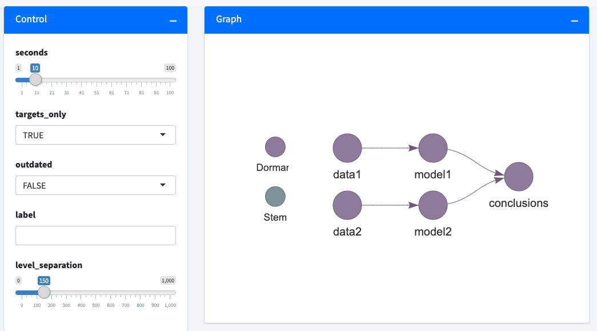
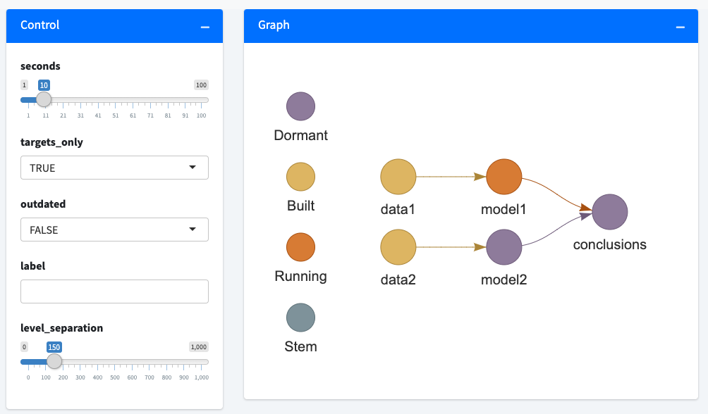

```{r, include = FALSE}
knitr::opts_chunk$set(echo = TRUE, eval = FALSE)
```

## An example

The [`targets`](https://docs.ropensci.org/targets) package has a new Shiny app to monitor progress.^[The full source code of the [`tar_watch()`](https://docs.ropensci.org/targets/reference/tar_watch.html) app is [available in the `targets` package](https://github.com/wlandau/targets/blob/252c9c9d7dadad680a58289a75d2f563c6c1f768/R/tar_watch.R). To embed this feature in your own app as a Shiny module, see functions [`tar_watch_ui()`](https://docs.ropensci.org/targets/reference/tar_watch_ui.html) and [`tar_watch_server()`](https://docs.ropensci.org/targets/reference/tar_watch_server.html)] To try it out, set up a new pipeline.

```{r}
# Write in _targets.R:
library(targets)
sleep_run <- function(...) Sys.sleep(10)
list(
  tar_target(data1, sleep_run()),
  tar_target(data2, sleep_run()),
  tar_target(model1, sleep_run(data1)),
  tar_target(model2, sleep_run(data2)),
  tar_target(conclusions, sleep_run(c(model1, model2)))
)
```

Then launch the app in your R console.

```{r}
library(targets)
tar_watch(targets_only = TRUE, outdated = FALSE, seconds = 10)
#> ● url: http://127.0.0.1:57726
#> ● host: 127.0.0.1
#> ● port: 57726
```

A new browser window should show a [`visNetwork`](http://datastorm-open.github.io/visNetwork) graph that reloads every 10 seconds.



The app does not block your R session, so your R console is free to run the pipeline.

```{r}
tar_make()
#> ● run target data1
#> ● run target data2
#> ● run target model1
```

As the pipeline progresses, the [`visNetwork`](http://datastorm-open.github.io/visNetwork) graph should periodically refresh and show you the latest status of each target.



## The challenge

Shiny functions [`shinyApp()`](https://shiny.rstudio.com/reference/shiny/1.5.0/shinyApp.html) and [`runApp()`](https://shiny.rstudio.com/reference/shiny/1.5.0/runApp.html) both block the R console. While they are running, your R session cannot do anything else.

```{r}
> runApp()

Listening on http://127.0.0.1:5160
```

So how is it possible to run [`tar_watch()`](https://docs.ropensci.org/targets/reference/tar_watch.html) and [`tar_make()`](https://docs.ropensci.org/targets/reference/tar_make.html) at the same time?

## A convenient solution

First, write a function that actually runs the app at a given IP address^[Most users can use `localhost` (`host = "127.0.0.1"`). If your web browser is running on a different computer than the one running the app, use `host = "0.0.0.0"` and ensure the two computers share the same local network.] and TCP port.^[For a personal app like this, I recommend choosing a port in the dynamic range between 49152 and 65535 so it does not conflict with critical infrastructure on your computer.] The `options` argument of [`shinyApp()`](https://shiny.rstudio.com/reference/shiny/1.5.0/shinyApp.html) is key.

```{r}
run_app <- function(host = "127.0.0.1", port = 49152) {
  ui <- bs4Dash::bs4DashPage(...) # bs4Dash creates nice-looking Shiny UIs.
  server <- function(input, output, session) {...}
  shiny::shinyApp(ui, server, options = list(host = host, port = port))
}
```

Next, launch the app in a  [`callr::r_bg()`](https://callr.r-lib.org/reference/r_bg.html) background process.

```{r}
args <- list(host = "127.0.0.1", port = 49152)
process <- callr::r_bg(func = run_app, args = args, supervise = TRUE)
```

At this point, the app may take an unpredictable length of time to initialize. With  [`pingr`](https://github.com/r-lib/pingr), we can wait until the app comes online.^[This loop may take few seconds, so a [`cli` spinner](https://cli.r-lib.org/reference/make_spinner.html) is a nice touch.] We also check if the background process quit early and forward any errors to the parent process.^[Thanks [Kirill Müller](https://github.com/krlmlr/) for [thinking of this](https://twitter.com/krlmlr/status/1340165944732250113).]

```{r}
while(!pingr::is_up(destination = "127.0.0.1", port = 49152)) {
  if (!process$is_alive()) stop(process$read_all_error())
  Sys.sleep(0.01)
}
```

After the loop completes, open the app in a web browser.

```{r}
browseURL("http://127.0.0.1:49152")
```

Now, you can use the app and the R console at the same time.

```{r}
> # Ready for input.
```
